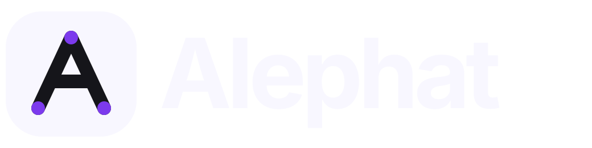

<div align="center">
  <a href="https://github.com/moule3053/alephat">
    <picture>
      <source media="(prefers-color-scheme: dark)" srcset="assets/dark.svg">
      <source media="(prefers-color-scheme: light)" srcset="assets/light.svg">
      
    </picture>
  </a>
</div>

<div align="center">
  <h3>Open-source framework for building your org's internal coding agent.</h3>
</div>

<div align="center">
  <a href="https://opensource.org/licenses/MIT" target="_blank"></a>
  <a href="https://github.com/moule3053/alephat/stargazers" target="_blank"></a>
  <a href="https://github.com/langchain-ai/langgraph" target="_blank"></a>
  <a href="https://github.com/langchain-ai/deepagents" target="_blank"></a>
</div>

<br>

Elite engineering orgs like Stripe, Ramp, and Coinbase are building their own internal coding agents — Slackbots, CLIs, and web apps that meet engineers where they already work. These agents are connected to internal systems with the right context, permissioning, and safety boundaries to operate with minimal human oversight.

Alephat is the open-source version of this pattern. Built on [LangGraph](https://langchain-ai.github.io/langgraph/) and [Deep Agents](https://github.com/langchain-ai/deepagents), it gives you the same architecture those companies built internally: cloud sandboxes, Slack and Linear invocation, subagent orchestration, and automatic PR creation — ready to customize for your own codebase and workflows.

---

## Architecture

Alephat makes the same core architectural decisions as the best internal coding agents. Here's how it maps to the patterns described in [this overview](https://x.com/kishan_dahya/status/2028971339974099317) of Stripe's Minions, Ramp's Inspect, and Coinbase's Cloudbot:

### 1. Agent Harness — Composed on Deep Agents

Rather than forking an existing agent or building from scratch, Alephat **composes** on the [Deep Agents](https://github.com/langchain-ai/deepagents) framework — similar to how Ramp built on top of OpenCode. This gives you an upgrade path (pull in upstream improvements) while letting you customize the orchestration, tools, and middleware for your org.

```python
create_deep_agent(
    model="openai:gpt-5.6-sol",
    system_prompt=construct_system_prompt(...),
    tools=[http_request, fetch_url, linear_comment, slack_thread_reply],
    backend=sandbox_backend,
    middleware=[ToolErrorMiddleware(), check_message_queue_before_model, ...],
)
```

### 2. Sandbox — Isolated Cloud Environments

Every task runs in its own **isolated cloud sandbox** — a remote Linux environment with full shell access. The repo is cloned in, the agent gets full permissions, and the blast radius of any mistake is fully contained. No production access, no confirmation prompts.

Alephat supports multiple sandbox providers out of the box — [Modal](https://modal.com/), [Daytona](https://www.daytona.io/), [Runloop](https://www.runloop.ai/), [E2B](https://e2b.dev/), and [LangSmith](https://smith.langchain.com/) — and you can plug in your own. See the [Customization Guide](docs/CUSTOMIZATION.md#1-sandbox) for details.

This fork also supports the Kubernetes SIGs [Agent Sandbox](https://github.com/kubernetes-sigs/agent-sandbox) API. On GKE, each task can run in an Agent Sandbox Pod isolated by [Kata Containers](https://katacontainers.io/), while the Alephat control plane remains entirely in your cluster.

This follows the principle all three companies converge on: **isolate first, then give full permissions inside the boundary.**

- Each thread gets a persistent sandbox (reused across follow-up messages)
- Sandboxes auto-recreate if they become unreachable
- Multiple tasks run in parallel — each in its own sandbox, no queuing

### 3. Tools — Curated, Not Accumulated

Stripe's key insight: *tool curation matters more than tool quantity.* Alephat follows this principle with a small, focused toolset:

| Tool | Purpose |
|---|---|
| `execute` | Shell commands in the sandbox |
| `fetch_url` | Fetch web pages as markdown |
| `http_request` | API calls (GET, POST, etc.) |
| `linear_comment` | Post updates to Linear tickets |
| `linear_search_issues` | Search Linear issues by free text |
| `slack_add_reaction` | React to Slack messages |
| `slack_thread_reply` | Reply in Slack threads |

GitHub operations in the upstream LangSmith mode use `GH_TOKEN=dummy gh` through the LangSmith proxy. In standalone Kubernetes mode, the harness mints a short-lived GitHub App installation token and configures repository authentication inside the sandbox. The built-in Deep Agents tools include `read_file`, `write_file`, `edit_file`, `ls`, `glob`, `grep`, `write_todos`, and `task` (subagent spawning).

**Optional observability tools (server-side):** Admins can connect Datadog and LangSmith from team settings (Admin → Observability credentials). When connected, the agent gains Datadog tools (via Datadog's hosted MCP server, default `toolsets=core`) and read-only LangSmith tools (`langsmith_get_trace`, `langsmith_list_runs`). These run in the LangGraph server process using credentials encrypted at rest — the sandbox never holds Datadog or LangSmith keys. They are loaded **only for runs triggered by an authorized user** (admins, plus any emails in `OBSERVABILITY_AUTHORIZED_EMAILS`), so a prompt-injected run from an untrusted contributor cannot reach team observability data. Use scoped, read-oriented keys regardless: observability data (logs, traces) is attacker-influenced content that can carry prompt injection, and the agent has network egress — the same residual-risk class as `web_search` / `fetch_url`.

**Optional Corridor guardrails (server-side MCP):** Set `CORRIDOR_API_TOKEN` (or `CORRIDOR_MCP_TOKEN` / `CORRIDOR_TOKEN`) to load Corridor's hosted MCP server for each agent run. Alephat exposes only Corridor's `analyzePlan` tool. `CORRIDOR_MCP_URL` defaults to `https://app.corridor.dev/api/mcp`; if set explicitly, Alephat only accepts the same HTTPS host and `/api/mcp` path. Tokens are sent via `Authorization: Bearer ...` from the LangGraph server process and are never placed in the sandbox. A legacy `?token=...` URL is accepted and normalized into the header form.

### 4. Context Engineering — AGENTS.md + Source Context

Alephat gathers context from two sources:

- **`AGENTS.md`** — If the repo contains an `AGENTS.md` file at the root, it's read from the sandbox and injected into the system prompt. This is your repo-level equivalent of Stripe's rule files: encoding conventions, testing requirements, and architectural decisions that every agent run should follow.
- **Source context** — The full Linear issue (title, description, comments) or Slack thread history is assembled and passed to the agent, so it starts with rich context rather than discovering everything through tool calls.

### 5. Orchestration — Subagents + Middleware

Alephat's orchestration has two layers:

**Subagents:** The Deep Agents framework natively supports spawning child agents via the `task` tool. The main agent can fan out independent subtasks to isolated subagents — each with its own middleware stack, todo list, and file operations. This is similar to Ramp's child sessions for parallel work.

**Middleware:** Deterministic middleware hooks run around the agent loop:

- **`check_message_queue_before_model`** — Injects follow-up messages (Linear comments or Slack messages that arrive mid-run) before the next model call. You can message the agent while it's working and it'll pick up your input at its next step.
- **`notify_step_limit_reached`** — After-agent hook that posts a Slack reply when the agent hits the model-call limit, so users get a clear signal instead of silence.
- **`ToolErrorMiddleware`** — Catches and handles tool errors gracefully.

### 6. Invocation — Slack, Linear, and GitHub

All three companies in the article converge on **Slack as the primary invocation surface**. Alephat does the same:

- **Slack** — Mention the bot in any thread. Supports `repo:owner/name` syntax to specify which repo to work on. The agent replies in-thread with status updates and PR links.
- **Linear** — Comment `@alephat` on any issue. The agent reads the full issue context, reacts with 👀 to acknowledge, and posts results back as comments.
- **GitHub** — Tag `@alephat` in PR comments on agent-created PRs to have it address review feedback and push fixes to the same branch.

Each invocation creates a deterministic thread ID, so follow-up messages on the same issue or thread route to the same running agent.

### 7. Validation — Prompt-Driven

The agent is instructed to run linters, formatters, and tests before committing, and is responsible end-to-end for committing, pushing, opening/updating the draft PR, and replying in the source channel.
This is an area where you can extend Alephat for your org: add deterministic CI checks, visual verification, or review gates as additional middleware. See the [Customization Guide](docs/CUSTOMIZATION.md#6-middleware) for how.

---

## Comparison

| Decision | Alephat | Stripe (Minions) | Ramp (Inspect) | Coinbase (Cloudbot) |
|---|---|---|---|---|
| **Harness** | Composed (Deep Agents/LangGraph) | Forked (Goose) | Composed (OpenCode) | Built from scratch |
| **Sandbox** | Pluggable (Modal, Daytona, Runloop, etc.) | AWS EC2 devboxes (pre-warmed) | Modal containers (pre-warmed) | In-house |
| **Tools** | ~15, curated | ~500, curated per-agent | OpenCode SDK + extensions | MCPs + custom Skills |
| **Context** | AGENTS.md + issue/thread | Rule files + pre-hydration | OpenCode built-in | Linear-first + MCPs |
| **Orchestration** | Subagents + middleware | Blueprints (deterministic + agentic) | Sessions + child sessions | Three modes |
| **Invocation** | Slack, Linear, GitHub | Slack + embedded buttons | Slack + web + Chrome extension | Slack-native |
| **Validation** | Prompt-driven | 3-layer (local + CI + 1 retry) | Visual DOM verification | Agent councils + auto-merge |

---

## Features

- **Trigger from Linear, Slack, or GitHub** — mention `@alephat` in a comment to kick off a task
- **Instant acknowledgement** — reacts with 👀 the moment it picks up your message
- **Message it while it's running** — send follow-up messages mid-task and it'll pick them up before its next step
- **Run multiple tasks in parallel** — each task runs in its own isolated cloud sandbox
- **GitHub OAuth built-in** — authenticates with your GitHub account automatically
- **Opens PRs automatically** — commits changes and opens a draft PR when done, linked back to your ticket
- **Subagent support** — the agent can spawn child agents for parallel subtasks
- **Web dashboard** — a companion app (in `ui/`) for GitHub login, per-user model/profile settings, team defaults, enabled-repo and review-style management, user mappings, and an Agents chat UI

---

## Standalone GKE deployment: Kata, Agent Sandbox, LiteLLM, and KEDA

This fork can run Alephat's API, webhook receiver, dashboard, worker harness, PostgreSQL, NATS JetStream, LiteLLM gateway, and code sandboxes on Kubernetes. It does **not** require a LangSmith deployment, a commercial sandbox account, or any Alephat license key. The checked-in configuration uses the open-source editions of Agent Sandbox, Kata Containers, KEDA, NATS, PostgreSQL, and LiteLLM.

You still pay for GKE and model usage, and you must supply normal authentication credentials: a GitHub App plus an API key for each model provider you enable. Those are service credentials, not license keys. LiteLLM enterprise-only metering is disabled.

The following path creates a GKE Standard cluster with Intel N2 Ubuntu nodes, nested virtualization, Kata's `kata-qemu` runtime, the open-source Agent Sandbox controller, and KEDA scaling of harness workers from NATS JetStream lag.

> [!IMPORTANT]
> Google also offers a managed GKE Agent Sandbox add-on. On Standard clusters its admission policy currently requires gVisor. This guide uses the open-source Agent Sandbox controller because the requested runtime is Kata. See Google's [managed Agent Sandbox guide](https://docs.cloud.google.com/kubernetes-engine/docs/how-to/how-install-agent-sandbox) if you prefer gVisor instead. Kata on GKE is user-managed and is not covered by Google Cloud support.

### 1. Install the command-line prerequisites

Install and authenticate:

- [Google Cloud CLI](https://cloud.google.com/sdk/docs/install), including `gke-gcloud-auth-plugin`
- `kubectl`, [Helm 3](https://helm.sh/docs/intro/install/), and [Kustomize](https://kubectl.docs.kubernetes.io/installation/kustomize/)
- `git`, `curl`, and `openssl`

Use a Google Cloud project with billing enabled, then clone this fork and set deployment values:

```bash
export PROJECT_ID="your-gcp-project-id"
export REGION="us-central1"
export ZONE="us-central1-a"
export CLUSTER_NAME="alephat"
export AR_REPOSITORY="alephat"
export PLATFORM_NAMESPACE="alephat"
export SANDBOX_NAMESPACE="alephat-sandboxes"
export PLATFORM_IMAGE="${REGION}-docker.pkg.dev/${PROJECT_ID}/${AR_REPOSITORY}/alephat-platform:latest"
export UI_IMAGE="${REGION}-docker.pkg.dev/${PROJECT_ID}/${AR_REPOSITORY}/alephat-ui:latest"

# Required when publishing the dashboard with Traefik in step 9.
export DNS_DOMAIN="example.com"
export DNS_ZONE="example-com"
export ALEPHAT_HOST="alephat.example.com"
export ALEPHAT_ORIGIN="https://${ALEPHAT_HOST}"
export ACME_EMAIL="admin@example.com"
export TRAEFIK_IP_NAME="alephat-traefik"

gcloud config set project "$PROJECT_ID"
gcloud services enable \
  artifactregistry.googleapis.com \
  cloudbuild.googleapis.com \
  compute.googleapis.com \
  container.googleapis.com \
  dns.googleapis.com
```

If you use Gemini through Vertex AI instead of a Gemini API key, also enable `aiplatform.googleapis.com` and configure Workload Identity for LiteLLM. The simpler Google AI Studio API-key path is shown below.

### 2. Create the GKE cluster and install Kata Containers

Agent Sandbox maintains an [official Kata-on-GKE example](https://github.com/kubernetes-sigs/agent-sandbox/tree/main/examples/kata-gke-sandbox). Its setup script creates a zonal Standard cluster with Dataplane V2, IP aliases, nested virtualization, Ubuntu containerd, and an Intel N2 machine type; it then installs Kata and registers `RuntimeClass/kata-qemu`.

```bash
git clone --depth 1 https://github.com/kubernetes-sigs/agent-sandbox.git /tmp/agent-sandbox

(
  cd /tmp/agent-sandbox/examples/kata-gke-sandbox
  ./setup.sh \
    --cluster-name "$CLUSTER_NAME" \
    --zone "$ZONE" \
    --num-nodes 2 \
    --machine-type n2-standard-4 \
    --image-type UBUNTU_CONTAINERD
)
```

If you created the cluster separately with `--enable-nested-virtualization`, rerun the same script with `--reuse-cluster`. Do not use E2, N2D, Arm, or Container-Optimized OS nodes for this Kata path. Choose a zone where N2 machines and nested virtualization are available.

Verify cluster access and Kata:

```bash
gcloud container clusters get-credentials "$CLUSTER_NAME" --zone "$ZONE"
kubectl get nodes -o wide
kubectl get runtimeclass kata-qemu
kubectl -n kube-system rollout status daemonset/kata-deploy --timeout=10m
```

The upstream example currently pins Kata `3.2.0`. Review and pin a newer tested release deliberately before upgrading; changing the runtime on a live sandbox node pool should be treated as an infrastructure upgrade.

### 3. Install Agent Sandbox and the Kata sandbox template

This fork calls the `v1beta1` Agent Sandbox APIs. Release `v0.5.5` serves `v1beta1` and includes the extensions controller used by `SandboxTemplate`:

```bash
export AGENT_SANDBOX_VERSION="v0.5.5"

kubectl apply -f \
  "https://github.com/kubernetes-sigs/agent-sandbox/releases/download/${AGENT_SANDBOX_VERSION}/sandbox-with-extensions.yaml"

kubectl wait --for=condition=Established crd/sandboxes.agents.x-k8s.io --timeout=2m
kubectl wait --for=condition=Established \
  crd/sandboxtemplates.extensions.agents.x-k8s.io --timeout=2m
kubectl apply -f deploy/k8s/agent-sandbox-template.yaml

kubectl get runtimeclass kata-qemu
kubectl -n "$SANDBOX_NAMESPACE" get sandboxtemplate python-runtime-template
```

The checked-in template uses `runtimeClassName: kata-qemu`, the Agent Sandbox Python toolbox on port `8888`, a non-root user, no service-account token, dropped capabilities, and resource limits. The harness creates a direct `Sandbox` from this template for every task; a warm pool is not required by this provider.

### 4. Install KEDA

KEDA scales the harness deployment from zero to fifty workers based on the pending message count for the durable `harness-workers` consumer on the `TASKS` JetStream stream. One harness Pod processes one task at a time.

```bash
helm repo add kedacore https://kedacore.github.io/charts
helm repo update
helm upgrade --install keda kedacore/keda \
  --namespace keda \
  --create-namespace \
  --version 2.20.0

kubectl -n keda rollout status deployment/keda-operator --timeout=5m
kubectl get crd scaledobjects.keda.sh
```

The NATS JetStream scaler is included in KEDA; no separate scaler installation is required. The `ScaledObject` is applied after Alephat starts once, so the API has created the streams and the initial harness has created its durable consumer.

### 5. Deploy standalone LiteLLM with OpenAI, Anthropic, and Gemini routes

Create the platform namespace and LiteLLM secrets. Omit a provider key only after removing its corresponding model entry from `deploy/k8s/litellm-values.yaml`.

```bash
kubectl create namespace "$PLATFORM_NAMESPACE" \
  --dry-run=client -o yaml | kubectl apply -f -

read -rsp "OpenAI API key: " OPENAI_API_KEY; echo
read -rsp "Anthropic API key: " ANTHROPIC_API_KEY; echo
read -rsp "Gemini API key: " GEMINI_API_KEY; echo

export LITELLM_MASTER_KEY="sk-$(openssl rand -hex 24)"
export LITELLM_DB_PASSWORD="$(openssl rand -hex 24)"

kubectl -n "$PLATFORM_NAMESPACE" create secret generic litellm-secrets \
  --from-literal=masterkey="$LITELLM_MASTER_KEY"
kubectl -n "$PLATFORM_NAMESPACE" create secret generic litellm-provider-keys \
  --from-literal=OPENAI_API_KEY="$OPENAI_API_KEY" \
  --from-literal=ANTHROPIC_API_KEY="$ANTHROPIC_API_KEY" \
  --from-literal=GEMINI_API_KEY="$GEMINI_API_KEY"
kubectl -n "$PLATFORM_NAMESPACE" create secret generic litellm-postgres \
  --from-literal=postgres-password="$LITELLM_DB_PASSWORD" \
  --from-literal=password="$LITELLM_DB_PASSWORD"

helm upgrade --install alephat-platform \
  oci://ghcr.io/berriai/litellm-helm \
  --namespace "$PLATFORM_NAMESPACE" \
  --version 1.90.2 \
  --values deploy/k8s/litellm-values.yaml

kubectl -n "$PLATFORM_NAMESPACE" rollout status \
  deployment/alephat-platform-litellm --timeout=10m
```

The values file creates logical aliases that match the dashboard model IDs and routes them to OpenAI, Anthropic, and Gemini. Provider model names change over time and differ by account; update each `litellm_params.model` to a model enabled for your account. `DEFAULT_MODEL` in `deploy/k8s/configmap.yaml` must match one of the `model_name` aliases. See the official [LiteLLM provider examples](https://docs.litellm.ai/) and [Kubernetes production guide](https://docs.litellm.ai/docs/proxy/deploy).

This getting-started deployment gives LiteLLM its own bundled PostgreSQL instance. Alephat uses a different PostgreSQL StatefulSet in the next step. For production, use separate Cloud SQL databases and Redis if you run multiple LiteLLM replicas; do not share schemas or credentials between LiteLLM and Alephat.

Test the gateway from inside the cluster with any configured alias:

```bash
export MODEL_ALIAS="gemini-5.6-flash"

kubectl -n "$PLATFORM_NAMESPACE" run litellm-smoke \
  --rm -i --restart=Never --image=curlimages/curl -- \
  curl -fsS http://alephat-platform-litellm:4000/v1/chat/completions \
    -H "Authorization: Bearer ${LITELLM_MASTER_KEY}" \
    -H "Content-Type: application/json" \
    -d "{\"model\":\"${MODEL_ALIAS}\",\"messages\":[{\"role\":\"user\",\"content\":\"Reply with: litellm-ok\"}]}"
```

### 6. Create the GitHub App and Kubernetes secrets

Open **GitHub Settings → Developer settings → GitHub Apps → New GitHub App**. The same GitHub App provides dashboard OAuth and short-lived installation tokens for cloning and modifying repositories.

Under **Basic information**, configure:

Replace `alephat.example.com` below with the value of `ALEPHAT_HOST` from step 1.

- Homepage URL: use `http://127.0.0.1:18080` for port forwarding or `https://alephat.example.com` for production.
- Callback URLs: add every origin you will use. For this guide, add both:
  - `http://127.0.0.1:18080/dashboard/api/auth/callback`
  - `https://alephat.example.com/dashboard/api/auth/callback`
- Under **Identifying and authorizing users**, enable **Request user authorization (OAuth) during installation** once one callback is reachable. If you create and install the app before deploying the UI, save the callback URLs now and enable this option after step 9; the dashboard's Sign in button can also start the OAuth web flow explicitly and supplies the matching `redirect_uri`.
- Leave Device Flow disabled; the dashboard uses GitHub's web application flow.
- Enable webhooks and set the production Webhook URL to `https://alephat.example.com/hooks/github`. For local webhook development, use a tunnel to the webhook service; a loopback URL is not reachable by GitHub.
- Generate a webhook secret with `openssl rand -hex 32` and enter the same value in the `alephat-secrets` Secret below.

Set these repository permissions:

- Contents: Read & write
- Pull requests: Read & write
- Issues: Read & write
- Checks: Read & write
- Workflows: Read & write
- Metadata: Read-only
- Actions: Read-only when the agent should inspect GitHub Actions logs
- Organization members: Read-only when `ALLOWED_GITHUB_ORGS` is used to gate login

Subscribe to `Issue comment`, `Pull request review`, `Pull request review comment`, `Check run`, `Check suite`, and `Workflow run`. The [detailed GitHub App permissions guide](docs/INSTALLATION.md#3-create-a-github-app) explains optional status events and why each permission is needed.

After creating the app:

1. Copy the App ID and OAuth Client ID.
2. Generate an OAuth client secret.
3. Generate and download a private-key `.pem` file.
4. Select **Install App**, choose the account or organization, and grant access only to the repositories Alephat should operate on.
5. Copy the numeric installation ID from the installation page URL.

`GITHUB_APP_CLIENT_ID` and `GITHUB_APP_CLIENT_SECRET` are used for browser OAuth. `GITHUB_APP_ID`, `GITHUB_APP_PRIVATE_KEY`, and `GITHUB_APP_INSTALLATION_ID` are used server-side to mint installation tokens. The private key and client secret must never be exposed to the browser or sandbox.

```bash
export GITHUB_APP_ID="123456"
export GITHUB_APP_CLIENT_ID="Iv1.example"
export GITHUB_APP_CLIENT_SECRET="replace-me"
export GITHUB_APP_INSTALLATION_ID="12345678"
export GITHUB_APP_PRIVATE_KEY_FILE="/absolute/path/to/github-app.private-key.pem"
export GITHUB_WEBHOOK_SECRET="$(openssl rand -hex 32)"
export ALEPHAT_DB_PASSWORD="$(openssl rand -hex 24)"
export PLATFORM_API_TOKEN="$(openssl rand -hex 32)"
export PLATFORM_JWT_SECRET="$(openssl rand -hex 32)"
export DASHBOARD_JWT_SECRET="$(openssl rand -hex 32)"
export TOKEN_ENCRYPTION_KEY="$(openssl rand -base64 32 | tr '+/' '-_' | tr -d '\n')"

kubectl -n "$PLATFORM_NAMESPACE" create secret generic alephat-postgres \
  --from-literal=password="$ALEPHAT_DB_PASSWORD"
kubectl -n "$PLATFORM_NAMESPACE" create secret generic alephat-secrets \
  --from-literal=PLATFORM_API_TOKEN="$PLATFORM_API_TOKEN" \
  --from-literal=PLATFORM_JWT_SECRET="$PLATFORM_JWT_SECRET" \
  --from-literal=GITHUB_WEBHOOK_SECRET="$GITHUB_WEBHOOK_SECRET"
kubectl -n "$PLATFORM_NAMESPACE" create secret generic alephat-oauth \
  --from-literal=GITHUB_APP_ID="$GITHUB_APP_ID" \
  --from-literal=GITHUB_APP_CLIENT_ID="$GITHUB_APP_CLIENT_ID" \
  --from-literal=GITHUB_APP_CLIENT_SECRET="$GITHUB_APP_CLIENT_SECRET" \
  --from-literal=GITHUB_APP_INSTALLATION_ID="$GITHUB_APP_INSTALLATION_ID" \
  --from-file=GITHUB_APP_PRIVATE_KEY="$GITHUB_APP_PRIVATE_KEY_FILE" \
  --from-literal=DASHBOARD_JWT_SECRET="$DASHBOARD_JWT_SECRET" \
  --from-literal=TOKEN_ENCRYPTION_KEY="$TOKEN_ENCRYPTION_KEY"
```

For production, create these secrets with Secret Manager plus External Secrets or the Secrets Store CSI driver instead of putting values in shell history. Never commit rendered Secrets, private keys, or API keys.

### 7. Build and push the Alephat images

Create an Artifact Registry Docker repository and submit both builds to Cloud Build:

```bash
gcloud artifacts repositories describe "$AR_REPOSITORY" \
  --location "$REGION" >/dev/null 2>&1 || \
gcloud artifacts repositories create "$AR_REPOSITORY" \
  --repository-format docker \
  --location "$REGION"

gcloud builds submit . \
  --config cloudbuild.platform.yaml \
  --substitutions="_PLATFORM_IMAGE=${PLATFORM_IMAGE}"
gcloud builds submit . \
  --config cloudbuild.ui.yaml \
  --substitutions="_UI_IMAGE=${UI_IMAGE}"
```

Point Kustomize at those images without editing every Deployment:

```bash
(
  cd deploy/k8s
  kustomize edit set image \
    "us-central1-docker.pkg.dev/your-gcp-project-id/alephat/alephat-platform=${PLATFORM_IMAGE}" \
    "us-central1-docker.pkg.dev/your-gcp-project-id/alephat/alephat-ui=${UI_IMAGE}"
)
```

If you use a different LiteLLM release or logical model name, update `deploy/k8s/litellm-values.yaml` and `deploy/k8s/configmap.yaml` before applying the manifests.

### 8. Deploy Alephat and enable KEDA scaling

The RBAC and NetworkPolicy manifests are separate because they target `alephat-sandboxes`, while the Kustomize base applies its namespace transformer to the `alephat` platform resources.

If upgrading an earlier version of this fork that used `emptyDir`, first stop task submission, let
queued/running tasks finish, and export PostgreSQL before the rollout. The old NATS stream was
ephemeral, so no queued work should remain when NATS restarts:

```bash
kubectl -n "$PLATFORM_NAMESPACE" exec alephat-postgresql-0 -- \
  sh -c 'PGPASSWORD="$POSTGRES_PASSWORD" pg_dump --clean --if-exists -U alephat -d alephat' \
  > alephat-before-pvc.sql
```

Keep that backup outside the cluster. After applying, verify the PVCs are bound and restore the dump
if this was an upgrade; a fresh installation does not need a restore.

```bash
kubectl apply -f deploy/k8s/agent-sandbox-rbac.yaml
kubectl apply -f deploy/k8s/agent-sandbox-networkpolicy.yaml
kubectl apply -k deploy/k8s

kubectl -n "$PLATFORM_NAMESPACE" wait \
  --for=condition=complete job/alephat-migrate --timeout=5m
kubectl -n "$PLATFORM_NAMESPACE" rollout status deployment/alephat-api --timeout=10m
kubectl -n "$PLATFORM_NAMESPACE" rollout status deployment/alephat-webhook --timeout=10m
kubectl -n "$PLATFORM_NAMESPACE" rollout status deployment/alephat-ui --timeout=10m
kubectl -n "$PLATFORM_NAMESPACE" rollout status deployment/alephat-harness --timeout=10m

if [ -f alephat-before-pvc.sql ]; then
  kubectl -n "$PLATFORM_NAMESPACE" exec -i alephat-postgresql-0 -- \
    sh -c 'PGPASSWORD="$POSTGRES_PASSWORD" psql -v ON_ERROR_STOP=1 -U alephat -d alephat' \
    < alephat-before-pvc.sql
fi

kubectl apply -f deploy/k8s/harness-keda.yaml
kubectl -n "$PLATFORM_NAMESPACE" get scaledobject alephat-harness
kubectl -n "$PLATFORM_NAMESPACE" get hpa
```

The platform base intentionally does not include `harness-keda.yaml`: installing the base must remain possible before KEDA's CRDs exist. Once the `ScaledObject` is active, the harness can scale to zero while idle and scale out as tasks accumulate.

Check all components:

```bash
kubectl -n "$PLATFORM_NAMESPACE" get pods,svc
kubectl -n "$PLATFORM_NAMESPACE" get pvc
kubectl -n "$SANDBOX_NAMESPACE" get sandboxtemplate
kubectl -n keda get pods
kubectl -n "$PLATFORM_NAMESPACE" logs deployment/alephat-harness --tail=100
```

The checked-in Alephat PostgreSQL and NATS manifests each request a `20Gi`
`standard-rwo` GKE persistent disk. LiteLLM's separate PostgreSQL instance requests another `20Gi`
disk through its Helm values. PostgreSQL data and NATS JetStream state therefore survive Pod
restarts and rescheduling. Set a different storage class or capacity in
`deploy/k8s/postgresql.yaml`, `deploy/k8s/nats.yaml`, and `deploy/k8s/litellm-values.yaml` before the
first apply when required. PVC capacity can be expanded later when the selected StorageClass allows
expansion, but it cannot be shrunk.

### 9. Publish Alephat with Traefik, HTTPS, and DNS

For production, reserve a regional external IPv4 address in the same region and network tier as the GKE cluster. Keeping the address reserved prevents it from changing when the Traefik Service is recreated.

```bash
gcloud compute addresses describe "$TRAEFIK_IP_NAME" \
  --region "$REGION" >/dev/null 2>&1 || \
gcloud compute addresses create "$TRAEFIK_IP_NAME" \
  --region "$REGION" \
  --network-tier PREMIUM

export TRAEFIK_IP="$(gcloud compute addresses describe "$TRAEFIK_IP_NAME" \
  --region "$REGION" \
  --format='value(address)')"
echo "$TRAEFIK_IP"
```

Install the official Traefik chart. The checked-in values expose ports 80 and 443, redirect HTTP to HTTPS, persist ACME state, and configure a Let's Encrypt HTTP-01 resolver. A single replica is intentional because the open-source file-based ACME store must not be written concurrently by multiple Traefik replicas.

```bash
helm repo add traefik https://traefik.github.io/charts
helm repo update
helm upgrade --install traefik traefik/traefik \
  --namespace traefik \
  --create-namespace \
  --version 41.2.0 \
  --values deploy/k8s/traefik-values.yaml \
  --set-string "service.spec.loadBalancerIP=${TRAEFIK_IP}" \
  --set-string "certificatesResolvers.letsencrypt.acme.email=${ACME_EMAIL}" \
  --wait

kubectl -n traefik get service traefik
kubectl -n traefik get pvc
```

If the domain is already hosted by Cloud DNS, use its managed-zone name as `DNS_ZONE`. To create a new public managed zone:

```bash
gcloud dns managed-zones describe "$DNS_ZONE" >/dev/null 2>&1 || \
gcloud dns managed-zones create "$DNS_ZONE" \
  --dns-name="${DNS_DOMAIN%.}." \
  --description="Alephat public DNS zone"

gcloud dns managed-zones describe "$DNS_ZONE" \
  --format='value(nameServers)'
```

For a newly created zone, configure the listed name servers at your domain registrar and wait for delegation to propagate. Then create the dashboard A record:

```bash
gcloud dns record-sets create "${ALEPHAT_HOST%.}." \
  --zone "$DNS_ZONE" \
  --type A \
  --ttl 300 \
  --rrdatas "$TRAEFIK_IP"

dig +short "$ALEPHAT_HOST"
```

If DNS is hosted outside Cloud DNS, create the equivalent `A` record with that provider. Do not create the TLS route until public DNS resolves to `TRAEFIK_IP`; Let's Encrypt must reach port 80 for the HTTP-01 challenge.

Apply the Traefik route after replacing the example hostname. `/hooks/*` goes directly to the webhook service; all other paths go to the UI, whose Nginx configuration proxies `/dashboard/api/*` and `/v1/*` to the API.

```bash
sed "s/alephat\.example\.com/${ALEPHAT_HOST}/g" \
  deploy/k8s/traefik-ingressroute.yaml | kubectl apply -f -
```

Update the runtime URLs so OAuth emits the production callback, cookies are marked secure, and CORS accepts the public origin. Keep the same values in your permanent Kustomize overlay or `configmap.yaml`; otherwise a later base apply will restore the loopback defaults.

```bash
kubectl -n "$PLATFORM_NAMESPACE" patch configmap alephat-config \
  --type merge \
  --patch "{\"data\":{\"DASHBOARD_BASE_URL\":\"${ALEPHAT_ORIGIN}\",\"DASHBOARD_API_BASE_URL\":\"${ALEPHAT_ORIGIN}\",\"DASHBOARD_ALLOWED_ORIGINS\":\"${ALEPHAT_ORIGIN}\",\"CORS_ORIGINS\":\"${ALEPHAT_ORIGIN}\"}}"

kubectl -n "$PLATFORM_NAMESPACE" rollout restart \
  deployment/alephat-api \
  deployment/alephat-webhook \
  deployment/alephat-harness
kubectl -n "$PLATFORM_NAMESPACE" rollout status deployment/alephat-api --timeout=10m

curl -fsS "${ALEPHAT_ORIGIN}/healthz"
curl -sS -o /dev/null -D - "${ALEPHAT_ORIGIN}/dashboard/api/auth/login"
kubectl -n traefik logs deployment/traefik --tail=100
```

Return to the GitHub App settings and verify that these exact production values are saved before testing login or deliveries:

- Callback URL: `${ALEPHAT_ORIGIN}/dashboard/api/auth/callback`
- Webhook URL: `${ALEPHAT_ORIGIN}/hooks/github`
- Webhooks: active
- Request user authorization (OAuth) during installation: enabled

For highly available ingress, use multiple Traefik replicas with cert-manager or another shared certificate-management design instead of the single-writer ACME file shown here.

### 10. Open the UI and run an end-to-end coding task

For a local deployment, start the port forward and keep it running:

```bash
kubectl -n "$PLATFORM_NAMESPACE" port-forward service/alephat-ui 18080:80
```

Open [http://127.0.0.1:18080](http://127.0.0.1:18080), sign in with GitHub, select a repository installed for the GitHub App, and submit a small task such as:

For the Traefik deployment, open `https://alephat.example.com` using your configured hostname instead. GitHub should redirect back to `/dashboard/api/auth/callback`, set the secure `alephat_session` cookie, and return to the dashboard.

```text
Add a short "Testing notes" section to README.md, inspect the diff, and report the changed files.
```

In another terminal, watch KEDA activate the harness and Agent Sandbox create a Kata-backed sandbox:

```bash
kubectl -n "$PLATFORM_NAMESPACE" get deployment alephat-harness -w
kubectl -n "$SANDBOX_NAMESPACE" get sandbox,pod -w
```

While the task is running, prove that its Pod uses Kata and that commands execute there:

```bash
export SANDBOX_POD="$(kubectl -n "$SANDBOX_NAMESPACE" get pod \
  -l app.kubernetes.io/name=alephat-python-sandbox \
  -o jsonpath='{.items[0].metadata.name}')"

kubectl -n "$SANDBOX_NAMESPACE" get pod "$SANDBOX_POD" \
  -o jsonpath='{.spec.runtimeClassName}{"\n"}'
kubectl -n "$SANDBOX_NAMESPACE" exec "$SANDBOX_POD" -- uname -r
kubectl -n "$SANDBOX_NAMESPACE" exec "$SANDBOX_POD" -- git diff --stat
```

The first command must print `kata-qemu`. A successful task should show model events in the UI, command/tool events from the sandbox, and a final response. After the cooldown period, KEDA should return the harness to zero replicas if no tasks remain.

### 11. Production hardening and cleanup

The checked-in manifests are a reproducible standalone starting point, not an HA production topology:

- `deploy/k8s/postgresql.yaml` gives Alephat a dedicated PostgreSQL StatefulSet backed by a GKE
  persistent disk. Configure scheduled backups and use Cloud SQL for regional HA, point-in-time
  recovery, and managed failover.
- `deploy/k8s/nats.yaml` persists JetStream state on a GKE disk but remains a single NATS server.
  Use the official NATS Helm chart with a three-node JetStream cluster and disruption budgets when
  queue availability must survive a node or zone failure.
- The LiteLLM chart's standalone PostgreSQL is also a getting-started option. Use a separate managed database, backups, and Redis for multi-replica LiteLLM.
- Back up Traefik's ACME volume or move certificate lifecycle to cert-manager before making ingress highly available.
- Restrict GitHub App repository access, configure NetworkPolicies and egress controls, set ResourceQuotas in the sandbox namespace, and enable GKE node autoscaling for the Kata pool.
- Pin container, Helm chart, Agent Sandbox, and Kata versions and test upgrades in a non-production cluster.

Deleting the namespace or any PVC can delete its underlying disk, depending on the StorageClass
reclaim policy. Take a database backup and a JetStream snapshot before destructive maintenance.

Delete the cluster when it is no longer needed:

```bash
gcloud container clusters delete "$CLUSTER_NAME" --zone "$ZONE" --quiet
```

References: [GKE Agent Sandbox](https://docs.cloud.google.com/kubernetes-engine/docs/concepts/machine-learning/agent-sandbox), [Agent Sandbox releases](https://github.com/kubernetes-sigs/agent-sandbox/releases), [Kata installation](https://github.com/kata-containers/kata-containers/blob/main/docs/installation.md), [KEDA installation](https://keda.sh/docs/2.20/deploy/), [KEDA NATS JetStream scaler](https://keda.sh/docs/2.20/scalers/nats-jetstream/), [Traefik Kubernetes installation](https://doc.traefik.io/traefik/getting-started/kubernetes/), [GKE static LoadBalancer addresses](https://docs.cloud.google.com/kubernetes-engine/docs/concepts/service-load-balancer-parameters), [Cloud DNS records](https://docs.cloud.google.com/dns/docs/records), and [GitHub App OAuth callbacks](https://docs.github.com/en/apps/creating-github-apps/registering-a-github-app/about-the-user-authorization-callback-url).

---

## Getting Started

- **[Installation Guide](docs/INSTALLATION.md)** — local dev (backend + dashboard), GitHub App creation, LangSmith, Linear/Slack/GitHub triggers, and production deployment
- **[Customization Guide](docs/CUSTOMIZATION.md)** — swap the sandbox, model, tools, triggers, system prompt, and middleware for your org

## License

MIT
